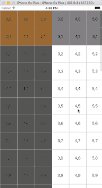

# UICollectionViewFreezeLayout

[](https://travis-ci.org/rafael zhou/UICollectionViewFreezeLayout)
[](http://cocoapods.org/pods/UICollectionViewFreezeLayout)
[](http://cocoapods.org/pods/UICollectionViewFreezeLayout)
[](http://cocoapods.org/pods/UICollectionViewFreezeLayout)

## Description

The UICollectionViewFreezeLayout extends UICollectionViewLayout. 

Support both Horizontal and Vertical scroll direct.

Can set freeze coloums numbers and rows numbers.


## Example

To run the example project, clone the repo, and run `pod install` from the Example directory first.

The `Spring` class also serves as an example of how some of the internal components of the framework can be composed to build new components.

```swift
let layout = UICollectionViewFreezeLayout()
layout.delegate = self
layout.freezeColum = 3
layout.freezeRow = 2
layout.itemSize = CGSize(width: 70, height: 70)
        
        
collectionView.setCollectionViewLayout(layout, animated: false)
collectionView.backgroundColor = UIColor.whiteColor()
collectionView.bounces = false
```



## Requirements

## Installation

UICollectionViewFreezeLayout is available through [CocoaPods](http://cocoapods.org). To install
it, simply add the following line to your Podfile:

```ruby
pod "UICollectionViewFreezeLayout"
```

## Author

rafael zhou, wumingapie@gmail.com

## License

UICollectionViewFreezeLayout is available under the MIT license. See the LICENSE file for more info.
